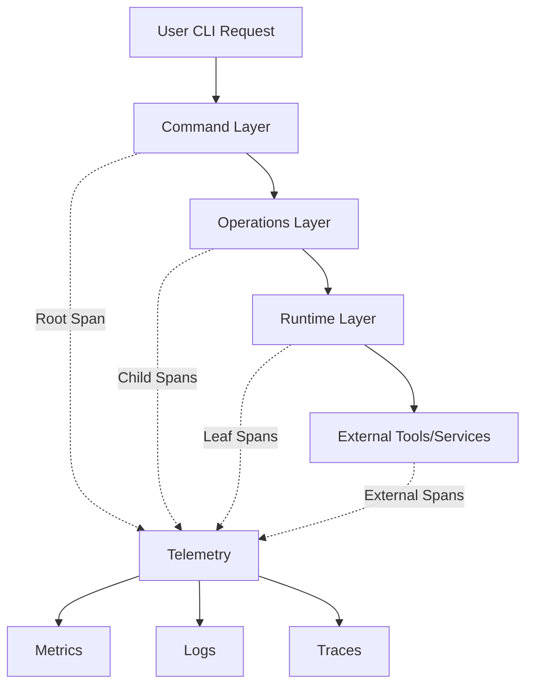

# WEAVER-FORGE-UPGRADE: 100% OpenTelemetry Coverage for uvmgr

## Executive Summary

This document outlines the comprehensive upgrade plan to achieve 100% OpenTelemetry (OTEL) observability coverage in uvmgr using Weaver Forge automated generation patterns. Currently, uvmgr has ~40% coverage with gaps in command instrumentation, metrics, semantic conventions, and error handling.

## Current State Analysis

### Coverage Status
- ✅ **Runtime Layer**: 70% instrumented
- ⚠️ **Operations Layer**: 50% instrumented  
- ❌ **Command Layer**: 0% instrumented
- ❌ **Metrics**: Defined but unused
- ❌ **Semantic Conventions**: Not implemented
- ❌ **Error Tracking**: Not implemented

### Key Gaps
1. All 17 command modules lack telemetry
2. Direct subprocess calls bypass instrumentation
3. No metrics collection
4. No semantic conventions
5. Missing error recording and propagation

## Target Architecture

### 100% OTEL Coverage Goals


### Semantic Convention Domains
1. **CLI Operations**: `cli.*` 
2. **Package Management**: `package.*`
3. **Build Operations**: `build.*`
4. **Test Operations**: `test.*`
5. **AI Operations**: `ai.*`

## Weaver Forge Generation Patterns

### 1. Command Instrumentation Pattern

```yaml
# weaver-forge/templates/command_telemetry.yaml
name: command_telemetry
description: Generate OTEL instrumentation for CLI commands
inputs:
  - command_name: string
  - command_module: string
  - has_subcommands: boolean
output: |
  from functools import wraps
  from typing import Callable, Any
  from ...core.telemetry import span, metric_counter, record_exception
  from opentelemetry import trace
  from opentelemetry.semconv.trace import SpanAttributes
  
  def instrument_command(name: str = None):
      """Decorator to instrument CLI commands with OTEL."""
      def decorator(func: Callable) -> Callable:
          @wraps(func)
          def wrapper(*args, **kwargs) -> Any:
              command_name = name or func.__name__
              span_name = f"cli.command.{command_name}"
              
              with span(
                  span_name,
                  span_kind=trace.SpanKind.SERVER,
                  attributes={
                      "cli.command": command_name,
                      "cli.module": "{{ command_module }}",
                      "cli.args": str(args),
                      SpanAttributes.CODE_FUNCTION: func.__name__,
                      SpanAttributes.CODE_NAMESPACE: func.__module__,
                  }
              ) as current_span:
                  metric_counter(f"cli.command.{command_name}.calls")
                  
                  try:
                      result = func(*args, **kwargs)
                      current_span.set_status(trace.Status(trace.StatusCode.OK))
                      return result
                  except Exception as e:
                      record_exception(e)
                      current_span.set_status(
                          trace.Status(trace.StatusCode.ERROR, str(e))
                      )
                      metric_counter(f"cli.command.{command_name}.errors")
                      raise
          
          return wrapper
      return decorator
```

### 2. Operation Instrumentation Pattern

```yaml
# weaver-forge/templates/operation_telemetry.yaml
name: operation_telemetry
description: Generate OTEL instrumentation for operations
inputs:
  - operation_type: string  # deps, build, test, etc.
  - operation_name: string
output: |
  from opentelemetry.semconv.trace import SpanAttributes
  
  def instrument_operation(operation_type: str, operation_name: str):
      """Create instrumented operation with semantic conventions."""
      span_name = f"{operation_type}.{operation_name}"
      
      attributes = {
          "uvmgr.operation.type": operation_type,
          "uvmgr.operation.name": operation_name,
      }
      
      # Add semantic conventions based on operation type
      if operation_type == "package":
          attributes.update({
              "package.manager": "uv",
              "package.operation": operation_name,
          })
      elif operation_type == "build":
          attributes.update({
              "build.system": "python",
              "build.operation": operation_name,
          })
      elif operation_type == "test":
          attributes.update({
              "test.framework": "pytest",
              "test.operation": operation_name,
          })
      
      return span(span_name, **attributes)
```

### 3. Metrics Pattern

```yaml
# weaver-forge/templates/metrics_telemetry.yaml
name: metrics_telemetry
description: Generate OTEL metrics collection
inputs:
  - metric_namespace: string
  - metric_type: enum[counter, histogram, gauge]
output: |
  from opentelemetry import metrics
  from opentelemetry.sdk.metrics import MeterProvider
  from typing import Optional, Dict
  
  class {{ metric_namespace }}Metrics:
      """Metrics collection for {{ metric_namespace }} operations."""
      
      def __init__(self):
          self._meter = metrics.get_meter("uvmgr.{{ metric_namespace }}")
          self._init_metrics()
      
      def _init_metrics(self):
          # Counters
          self.operation_counter = self._meter.create_counter(
              name="{{ metric_namespace }}.operations",
              description="Total {{ metric_namespace }} operations",
              unit="1",
          )
          
          self.error_counter = self._meter.create_counter(
              name="{{ metric_namespace }}.errors",
              description="Total {{ metric_namespace }} errors",
              unit="1",
          )
          
          # Histograms
          self.duration_histogram = self._meter.create_histogram(
              name="{{ metric_namespace }}.duration",
              description="{{ metric_namespace }} operation duration",
              unit="s",
          )
          
          self.size_histogram = self._meter.create_histogram(
              name="{{ metric_namespace }}.size",
              description="Size of {{ metric_namespace }} operations",
              unit="By",
          )
          
          # Gauges
          self.active_gauge = self._meter.create_up_down_counter(
              name="{{ metric_namespace }}.active",
              description="Active {{ metric_namespace }} operations",
              unit="1",
          )
      
      def record_operation(
          self, 
          operation: str, 
          duration: float, 
          success: bool,
          attributes: Optional[Dict[str, Any]] = None
      ):
          """Record metrics for an operation."""
          attrs = attributes or {}
          attrs["operation"] = operation
          attrs["success"] = str(success)
          
          self.operation_counter.add(1, attrs)
          self.duration_histogram.record(duration, attrs)
          
          if not success:
              self.error_counter.add(1, attrs)
```

### 4. Error Handling Pattern

```yaml
# weaver-forge/templates/error_telemetry.yaml
name: error_telemetry
description: Generate OTEL error handling
output: |
  from opentelemetry import trace
  from opentelemetry.trace import Status, StatusCode
  from typing import Type, Optional
  import sys
  
  def record_exception(
      exception: Exception,
      escaped: bool = False,
      attributes: Optional[dict] = None
  ):
      """Record exception in current span with semantic conventions."""
      span = trace.get_current_span()
      if not span.is_recording():
          return
      
      exc_type = type(exception).__name__
      exc_message = str(exception)
      
      # Add semantic convention attributes
      event_attributes = {
          "exception.type": exc_type,
          "exception.message": exc_message,
          "exception.escaped": str(escaped),
      }
      
      if attributes:
          event_attributes.update(attributes)
      
      # Record full traceback
      if sys.exc_info()[0] is not None:
          import traceback
          event_attributes["exception.stacktrace"] = "".join(
              traceback.format_exception(*sys.exc_info())
          )
      
      span.add_event("exception", event_attributes)
      span.set_status(Status(StatusCode.ERROR, exc_message))
      
      # Add specific attributes for common errors
      if isinstance(exception, subprocess.CalledProcessError):
          span.set_attributes({
              "process.exit_code": exception.returncode,
              "process.command": " ".join(exception.cmd) if exception.cmd else "",
          })
      elif isinstance(exception, FileNotFoundError):
          span.set_attributes({
              "file.path": str(exception.filename) if exception.filename else "",
          })
```

### 5. Semantic Convention Definitions

```yaml
# weaver-forge/semantic-conventions/uvmgr.yaml
groups:
  - id: uvmgr.cli
    prefix: cli
    type: span
    brief: CLI command execution
    attributes:
      - id: command
        type: string
        brief: The CLI command being executed
        examples: ['deps add', 'build wheel', 'tests run']
        requirement_level: required
      - id: subcommand
        type: string
        brief: The subcommand if applicable
        examples: ['add', 'remove', 'list']
      - id: args
        type: string[]
        brief: Command arguments
      - id: exit_code
        type: int
        brief: CLI exit code

  - id: uvmgr.package
    prefix: package
    type: span
    brief: Package management operations
    attributes:
      - id: name
        type: string
        brief: Package name
        requirement_level: required
      - id: version
        type: string
        brief: Package version
      - id: operation
        type:
          allow_custom_values: false
          members:
            - id: add
              value: "add"
            - id: remove  
              value: "remove"
            - id: update
              value: "update"
            - id: lock
              value: "lock"
        brief: Package operation type
        requirement_level: required

  - id: uvmgr.build
    prefix: build
    type: span
    brief: Build operations
    attributes:
      - id: type
        type:
          allow_custom_values: false
          members:
            - id: wheel
              value: "wheel"
            - id: sdist
              value: "sdist"
            - id: exe
              value: "exe"
        brief: Build artifact type
        requirement_level: required
      - id: size
        type: int
        brief: Size of built artifact in bytes
      - id: duration
        type: double
        brief: Build duration in seconds
```

## Implementation Plan

### Phase 1: Foundation (Week 1)
1. **Upgrade Telemetry Core**
   ```python
   # Enhanced src/uvmgr/core/telemetry.py
   - Add metric_histogram, metric_gauge
   - Add record_exception function
   - Add semantic convention imports
   - Add span status management
   - Add context propagation helpers
   ```

2. **Generate Base Patterns**
   ```bash
   weaver-forge generate command_telemetry --all-commands
   weaver-forge generate operation_telemetry --all-ops
   weaver-forge generate metrics_telemetry --namespaces deps,build,test
   ```

### Phase 2: Command Layer (Week 2)
1. **Instrument All Commands**
   ```python
   # For each command module:
   @instrument_command("deps_add")
   def add(packages: List[str], dev: bool = False):
       # Existing code
   ```

2. **Add Semantic Attributes**
   ```python
   span.set_attributes({
       "cli.command": "deps",
       "cli.subcommand": "add", 
       "package.count": len(packages),
       "package.dev": dev,
   })
   ```

### Phase 3: Metrics Implementation (Week 3)
1. **Deploy Metrics Classes**
   ```python
   # src/uvmgr/core/metrics.py
   deps_metrics = DepsMetrics()
   build_metrics = BuildMetrics()
   test_metrics = TestMetrics()
   ```

2. **Integrate with Operations**
   ```python
   with timer() as t:
       result = operation()
   deps_metrics.record_operation(
       "add", t.elapsed, success=True,
       attributes={"package": package_name}
   )
   ```

### Phase 4: Error Handling (Week 4)
1. **Wrap All Exception Points**
   ```python
   try:
       result = subprocess.run(cmd)
   except Exception as e:
       record_exception(e, escaped=True)
       raise
   ```

2. **Add Span Status**
   ```python
   if result.returncode != 0:
       span.set_status(StatusCode.ERROR, "Command failed")
   ```

### Phase 5: Testing & Validation (Week 5)
1. **Generate Test Patterns**
   ```yaml
   # weaver-forge/templates/telemetry_tests.yaml
   - Verify span creation
   - Validate attributes
   - Check metric recording
   - Test error scenarios
   ```

2. **E2E Telemetry Tests**
   ```python
   def test_command_creates_spans():
       with mock_tracer() as tracer:
           run_command("deps", "add", "pytest")
           assert len(tracer.spans) > 0
           assert tracer.spans[0].name == "cli.command.deps_add"
   ```

## Validation Checklist

### Coverage Validation
- [ ] All 17 command modules instrumented
- [ ] All operations have spans
- [ ] All runtime calls traced
- [ ] Metrics recorded for key operations
- [ ] Errors properly recorded

### Semantic Convention Compliance
- [ ] CLI operations use `cli.*` attributes
- [ ] Package ops use `package.*` attributes  
- [ ] Build ops use `build.*` attributes
- [ ] Standard OTEL attributes used
- [ ] Custom attributes documented

### Performance Validation
- [ ] < 1% overhead from instrumentation
- [ ] Efficient attribute collection
- [ ] Proper sampling configuration
- [ ] No memory leaks from spans

### Integration Testing
- [ ] Traces visible in Jaeger/Tempo
- [ ] Metrics in Prometheus/Grafana
- [ ] Logs correlated with traces
- [ ] Distributed traces work

## Automation Scripts

### 1. Generate All Instrumentation
```bash
#!/bin/bash
# scripts/generate-telemetry.sh

# Generate command instrumentation
for cmd in $(ls src/uvmgr/commands/*.py | grep -v __); do
    weaver-forge generate command_telemetry \
        --command-module $(basename $cmd .py) \
        --output $cmd.telemetry
done

# Generate operation instrumentation  
for op in deps build test exec; do
    weaver-forge generate operation_telemetry \
        --operation-type $op \
        --output src/uvmgr/ops/$op.telemetry.py
done

# Generate metrics
weaver-forge generate metrics_telemetry \
    --metric-namespace deps \
    --output src/uvmgr/core/metrics/deps.py
```

### 2. Validate Coverage
```python
#!/usr/bin/env python3
# scripts/validate-telemetry-coverage.py

import ast
import sys
from pathlib import Path

def check_telemetry_coverage(file_path: Path) -> tuple[int, int]:
    """Check how many functions have telemetry."""
    with open(file_path) as f:
        tree = ast.parse(f.read())
    
    total_functions = 0
    instrumented = 0
    
    for node in ast.walk(tree):
        if isinstance(node, ast.FunctionDef):
            total_functions += 1
            # Check for @instrument_command or 'with span'
            for decorator in node.decorator_list:
                if 'instrument' in ast.unparse(decorator):
                    instrumented += 1
                    break
            else:
                # Check function body for 'with span'
                for child in ast.walk(node):
                    if isinstance(child, ast.With):
                        for item in child.items:
                            if 'span' in ast.unparse(item.context_expr):
                                instrumented += 1
                                break
    
    return instrumented, total_functions

# Check all Python files
coverage_stats = {}
for py_file in Path("src/uvmgr").rglob("*.py"):
    instrumented, total = check_telemetry_coverage(py_file)
    if total > 0:
        coverage_stats[py_file] = (instrumented / total) * 100

# Report
print("Telemetry Coverage Report")
print("=" * 50)
for file, coverage in sorted(coverage_stats.items(), key=lambda x: x[1]):
    print(f"{file}: {coverage:.1f}%")

overall = sum(coverage_stats.values()) / len(coverage_stats)
print(f"\nOverall Coverage: {overall:.1f}%")
```

### 3. Generate Dashboards
```yaml
# weaver-forge/templates/grafana_dashboard.yaml
name: uvmgr_telemetry_dashboard
description: Generate Grafana dashboards for uvmgr metrics
output: |
  {
    "dashboard": {
      "title": "uvmgr Telemetry Dashboard",
      "panels": [
        {
          "title": "Command Execution Rate",
          "targets": [{
            "expr": "rate(cli_command_calls_total[5m])",
            "legendFormat": "{{command}}"
          }]
        },
        {
          "title": "Operation Latency",
          "targets": [{
            "expr": "histogram_quantile(0.95, rate(operation_duration_seconds_bucket[5m]))",
            "legendFormat": "p95 {{operation}}"
          }]
        },
        {
          "title": "Error Rate",
          "targets": [{
            "expr": "rate(cli_command_errors_total[5m])",
            "legendFormat": "{{command}} errors"
          }]
        }
      ]
    }
  }
```

## Success Metrics

### Week 1-2 Milestones
- [ ] 100% command instrumentation
- [ ] All spans have proper attributes
- [ ] Basic metrics collection working

### Week 3-4 Milestones  
- [ ] Full metric coverage
- [ ] Error handling implemented
- [ ] Semantic conventions applied

### Week 5 Milestones
- [ ] E2E tests passing
- [ ] Performance within bounds
- [ ] Dashboards deployed

### Final Validation
- [ ] 100% OTEL coverage verified
- [ ] < 1% performance overhead
- [ ] Full observability achieved
- [ ] Automated generation working

## Appendix: Quick Start

```bash
# Install dependencies
pip install opentelemetry-api opentelemetry-sdk opentelemetry-exporter-otlp

# Generate all telemetry
./scripts/generate-telemetry.sh

# Validate coverage
python scripts/validate-telemetry-coverage.py

# Run with telemetry
OTEL_EXPORTER_OTLP_ENDPOINT=http://localhost:4317 uvmgr deps add pytest

# View traces
open http://localhost:16686  # Jaeger UI
```

## Resources

- [OpenTelemetry Python](https://opentelemetry.io/docs/instrumentation/python/)
- [Semantic Conventions](https://opentelemetry.io/docs/reference/specification/trace/semantic_conventions/)
- [Weaver Forge Docs](https://github.com/open-telemetry/weaver)
- [OTLP Specification](https://opentelemetry.io/docs/reference/specification/protocol/otlp/)