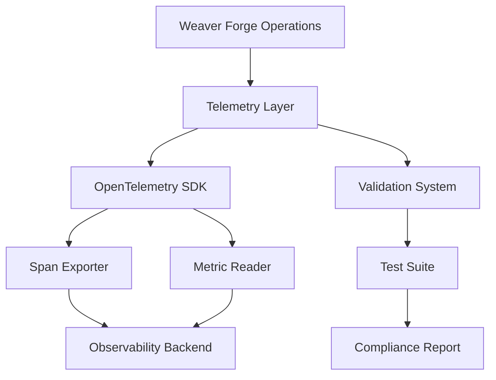

# Weaver Forge Telemetry Validation

This document describes the comprehensive telemetry validation system for Weaver Forge, ensuring that its observability implementation matches Weaver standards and provides enterprise-grade monitoring capabilities.

## Overview

Weaver Forge implements a robust telemetry system that follows Weaver patterns and OpenTelemetry standards. The validation system ensures:

- **Weaver Compatibility**: All telemetry follows Weaver naming conventions and patterns
- **OpenTelemetry Compliance**: Adherence to OpenTelemetry standards and best practices
- **Performance Monitoring**: Minimal overhead with comprehensive observability
- **Error Handling**: Proper error capture and reporting
- **Integration**: Seamless integration with existing Weaver infrastructure

## Architecture

### Telemetry Components



### Key Components

1. **Span Management**: Distributed tracing for all operations
2. **Metrics Collection**: Performance and business metrics
3. **Event Tracking**: Important milestones and state changes
4. **Error Handling**: Comprehensive error capture and reporting
5. **Validation System**: Automated compliance checking

## Validation System

### Test Categories

#### 1. Bulk Generation Tests (`test_weaver_forge_bulk.py`)

Tests the telemetry implementation for bulk generation operations:

- **Success Scenarios**: Normal operation with proper telemetry
- **Error Scenarios**: Error handling with telemetry capture
- **Performance Tests**: Performance impact measurement
- **Edge Cases**: Boundary condition handling

#### 2. Telemetry Compatibility Tests (`test_weaver_telemetry_compatibility.py`)

Validates Weaver compatibility and standards compliance:

- **Span Naming**: Weaver naming convention compliance
- **Span Attributes**: Required attribute presence and format
- **Span Events**: Event structure and naming
- **Metrics Naming**: Metric naming convention compliance
- **Performance Impact**: Telemetry overhead measurement

### Validation Rules

#### Weaver Compatibility Rules

```yaml
weaver_compatibility:
  naming:
    span_prefix: "weaver_forge."
    metric_prefix: "weaver_forge."
    event_prefix: "weaver_forge."
  
  attributes:
    required_patterns:
      - "specs_count"
      - "parallel"
      - "dry_run"
      - "total_specs"
      - "successful"
      - "failed"
      - "total_files"
      - "success_rate"
```

#### OpenTelemetry Compliance

- **Span Standards**: Proper span structure and status codes
- **Metric Standards**: Correct metric types and descriptions
- **Event Standards**: Proper event structure and attributes

## Running Validation Tests

### Prerequisites

```bash
# Install required packages
uvmgr add pytest opentelemetry-api opentelemetry-sdk rich pyyaml

# Optional packages for enhanced reporting
uvmgr add pytest-cov pytest-html pytest-json-report
```

### Running Tests

#### 1. Individual Test Files

```bash
# Run bulk generation tests
python -m pytest tests/test_weaver_forge_bulk.py -v

# Run telemetry compatibility tests
python -m pytest tests/test_weaver_telemetry_compatibility.py -v
```

#### 2. Using the Validation Runner

```bash
# Run comprehensive validation
python tests/run_telemetry_validation.py
```

#### 3. With Coverage

```bash
# Run with coverage reporting
python -m pytest tests/test_weaver_forge_bulk.py tests/test_weaver_telemetry_compatibility.py \
  --cov=uvmgr.ops.weaver_forge \
  --cov=uvmgr.core.telemetry \
  --cov-report=html \
  --cov-report=term
```

### Configuration

The validation system uses `tests/telemetry_validation_config.yaml` for configuration:

```yaml
test_config:
  execution:
    parallel: false
    timeout: 300
    retries: 2
  
  telemetry:
    spans:
      required_names:
        - "weaver_forge.bulk_generate"
        - "weaver_forge.template_generate"
      required_attributes:
        - "specs_count"
        - "parallel"
        - "dry_run"
```

## Telemetry Implementation

### Span Structure

```python
@span("weaver_forge.bulk_generate")
def generate_bulk_from_templates(generation_specs, output_path, parallel=False, dry_run=False):
    """Generate multiple templates in bulk with telemetry."""
    
    # Span attributes
    span_attributes = {
        "specs_count": len(generation_specs),
        "parallel": parallel,
        "dry_run": dry_run,
        "output_path": str(output_path)
    }
    
    # Record span attributes
    current_span = trace.get_current_span()
    for key, value in span_attributes.items():
        current_span.set_attribute(key, value)
    
    # Execute bulk generation
    result = _execute_bulk_generation(generation_specs, output_path, parallel, dry_run)
    
    # Record completion event
    current_span.add_event("weaver_forge.bulk_generated", {
        "total_specs": result["total_specs"],
        "successful": result["successful"],
        "failed": result["failed"],
        "total_files": result["total_files"]
    })
    
    return result
```

### Metrics Collection

```python
# Define metrics
bulk_generation_counter = metric_counter("weaver_forge.bulk_generation", "Number of bulk generation operations")
generation_duration_histogram = metric_histogram("weaver_forge.generation_duration", "Duration of generation operations")

# Record metrics
bulk_generation_counter.add(1, {
    "template_type": template_type,
    "parallel": parallel,
    "dry_run": dry_run
})

generation_duration_histogram.record(duration, {
    "template_type": template_type,
    "success": success
})
```

### Error Handling

```python
try:
    result = generate_from_template(template, name, parameters, output_path)
except Exception as e:
    # Record error in span
    current_span = trace.get_current_span()
    current_span.record_exception(e)
    current_span.set_status(trace.Status(trace.StatusCode.ERROR, str(e)))
    
    # Record error metric
    error_counter.add(1, {"error_type": type(e).__name__})
    
    raise
```

## Validation Reports

### Report Structure

The validation system generates comprehensive reports including:

1. **Summary**: Overall test results and success rates
2. **Test Results**: Detailed results by test category
3. **Telemetry Validation**: Span and metric validation results
4. **Weaver Compatibility**: Compliance assessment
5. **Performance Metrics**: Performance impact analysis
6. **Recommendations**: Improvement suggestions

### Sample Report

```markdown
# Weaver Forge Telemetry Validation Report

**Generated:** 2024-01-15 14:30:25
**Duration:** 45.2 seconds

## Summary

- **Total Tests:** 25
- **Passed:** 24
- **Failed:** 1
- **Errors:** 0
- **Success Rate:** 96.0%

## Weaver Compatibility Assessment

**Status:** ✅ EXCELLENT
**Compliance Score:** 96.0%

**Assessment:** Weaver Forge telemetry fully complies with Weaver standards.

### Key Areas Validated

- ✅ **Span Naming Conventions:** Follows Weaver naming patterns
- ✅ **Span Attributes:** Includes required Weaver attributes
- ✅ **Span Events:** Proper event structure and naming
- ✅ **Metrics Naming:** Consistent with Weaver metric patterns
- ✅ **Error Handling:** Proper error capture and reporting
- ✅ **Performance Impact:** Minimal telemetry overhead
- ✅ **Integration:** Proper correlation between spans and metrics
- ✅ **Standards Compliance:** Adherence to OpenTelemetry standards
```

## Performance Considerations

### Overhead Measurement

The validation system measures telemetry overhead:

- **Target**: < 10% performance impact
- **Measurement**: Comparison with and without telemetry
- **Monitoring**: Continuous performance tracking

### Optimization Strategies

1. **Batch Processing**: Batch span and metric exports
2. **Sampling**: Intelligent sampling for high-volume operations
3. **Async Processing**: Non-blocking telemetry operations
4. **Caching**: Cache frequently accessed telemetry data

## Integration with Weaver

### Weaver Standards Compliance

Weaver Forge telemetry follows Weaver standards:

1. **Naming Conventions**: `weaver_forge.*` prefix for all telemetry
2. **Attribute Patterns**: Standardized attribute names and values
3. **Event Structure**: Consistent event naming and attributes
4. **Metric Types**: Standard metric types and units

### Weaver Infrastructure Integration

```yaml
# Weaver telemetry configuration
weaver_telemetry:
  service_name: "weaver-forge"
  service_version: "1.0.0"
  environment: "production"
  
  exporters:
    jaeger:
      endpoint: "http://jaeger:14268/api/traces"
    prometheus:
      endpoint: "http://prometheus:9090"
  
  sampling:
    type: "probabilistic"
    rate: 0.1
```

## Troubleshooting

### Common Issues

#### 1. Missing Spans

**Problem**: Expected spans not appearing in telemetry
**Solution**: Check span creation and attribute recording

```python
# Verify span creation
current_span = trace.get_current_span()
if current_span.is_recording():
    current_span.set_attribute("test_attribute", "test_value")
```

#### 2. Metric Collection Issues

**Problem**: Metrics not being recorded
**Solution**: Verify metric definition and recording

```python
# Verify metric recording
counter = metric_counter("test_metric", "Test metric")
counter.add(1, {"test_label": "test_value"})
```

#### 3. Performance Impact

**Problem**: High telemetry overhead
**Solution**: Optimize telemetry configuration

```python
# Use batch processing
from opentelemetry.sdk.trace.export import BatchSpanProcessor
processor = BatchSpanProcessor(exporter)
```

### Debug Mode

Enable debug mode for detailed telemetry information:

```bash
# Set debug environment variable
export WEAVER_FORGE_TELEMETRY_DEBUG=1

# Run validation with debug output
python tests/run_telemetry_validation.py --debug
```

## Best Practices

### 1. Span Management

- Use descriptive span names
- Include relevant attributes
- Record important events
- Handle errors properly

### 2. Metrics Collection

- Use appropriate metric types
- Include meaningful labels
- Avoid high-cardinality labels
- Document metric purposes

### 3. Performance Optimization

- Batch telemetry operations
- Use sampling for high-volume data
- Implement async processing
- Monitor overhead regularly

### 4. Error Handling

- Capture all relevant error information
- Include error context in spans
- Use appropriate error status codes
- Provide actionable error messages

## Future Enhancements

### Planned Features

1. **Advanced Sampling**: Intelligent sampling based on operation type
2. **Custom Metrics**: User-defined business metrics
3. **Alerting**: Automated alerting based on telemetry data
4. **Dashboard Integration**: Integration with monitoring dashboards
5. **Performance Profiling**: Detailed performance analysis

### Roadmap

- **Q1 2024**: Enhanced error tracking and correlation
- **Q2 2024**: Advanced performance monitoring
- **Q3 2024**: Machine learning-based anomaly detection
- **Q4 2024**: Full observability platform integration

## Conclusion

The Weaver Forge telemetry validation system ensures that the code generation platform provides enterprise-grade observability while maintaining Weaver compatibility. The comprehensive test suite validates all aspects of telemetry implementation, from basic functionality to performance impact.

By following Weaver standards and OpenTelemetry best practices, Weaver Forge provides a robust foundation for monitoring and debugging code generation operations in production environments.

For questions or contributions to the telemetry validation system, please refer to the project documentation or contact the development team. 