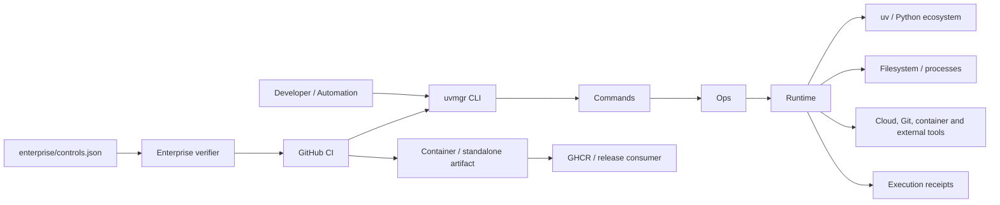

# Enterprise Architecture

## Architecture standing

This document defines the target and admitted architecture for `uvmgr`. It does not promote
an implementation to `ALIVE`; executable standing comes from exact-subject CI, capability
verification, behavioral tests, package/container manufacture, and receipts.

The repository-observable governance contract is `enterprise/controls.json` and is executed
by `python -m uvmgr.core.enterprise_contract`.

## Business capability map

`uvmgr` is a developer control plane for six enterprise capabilities:

| Capability | Responsibility | Primary evidence |
|---|---|---|
| Dependency governance | Resolve and operate exact Python dependency state | `uv.lock`, `deps` capability |
| Engineering execution | Execute tests, lint, build, workspace, and tool workflows | Commands → Ops → Runtime |
| Capability admission | Distinguish present source from admitted execution authority | command registry + capability ledger |
| Artifact manufacture | Build Python distributions, standalone executables, and containers | CI dogfood/container jobs |
| Delivery governance | Separate validation from publication and bind releases to immutable identity | CI + Release workflows |
| Evidence/replay | Bind exact subject, argv/result, source capsule, and artifact digest | `reports/receipts/`, CI artifacts |

## System context

## Layering and decision rights

- **Commands** own user-intent parsing and presentation. They do not own ambient actuation.
- **Ops** own deterministic planning, domain decisions, and reversible construction.
- **Runtime** is the external-effects boundary for processes, filesystems, tools, and network-facing actuation.
- **Core** owns shared policies, registries, instrumentation, receipts, and enterprise verification.
- **CI** may observe, compile, test, build, and receipt. Pull-request CI has no source-write authority.
- **Release** is the only repository-defined publication rail. Production publication is admitted from
  a semantic-version tag and emits immutable digest evidence.

This is an explicit separation of SELECT / CONSTRUCT / DO: decision and construction are
reversible; external actuation is bounded and receipted.

## Trust boundaries

1. **User input → command parser:** untrusted selectors, paths, flags, and external identifiers.
2. **Ops → Runtime:** transition from plan to side effect; this is the primary actuation boundary.
3. **Repository → dependency ecosystem:** lockfile and package-index supply-chain boundary.
4. **Repository → GitHub Actions:** third-party workflow code; every action ref is commit-pinned.
5. **Build → runtime image:** compiler/cache/source boundary; only the installed virtual environment
   crosses into the runtime image.
6. **Release workflow → GHCR:** publication authority; only the release job receives package-write permission.
7. **Public repository → enterprise platform:** branch protection, approvers, private vulnerability routing,
   contractual support, and customer identity controls remain external.

## Deployment architecture

`uvmgr` is stateless application software. Deployment units are:

- exact source checkout + frozen `uv.lock`;
- standalone PyInstaller executable;
- OCI container identified by immutable digest.

The production container runs as UID/GID `10001`, contains no compiler or `sudo`, and is built
separately from the builder stage. Release images are multi-architecture (`amd64`/`arm64`) and
are published with SBOM and provenance attestations.

## Non-functional control objectives

These are architecture objectives, not unmeasured claims:

- deterministic dependency admission from a frozen lock;
- least privilege in CI and runtime;
- immutable third-party CI dependencies;
- no silent promotion of structural presence to behavioral standing;
- no production publication from an arbitrary manually selected branch;
- rollback by immutable artifact identity;
- evidence sufficient to falsify a claimed successful execution.

## Enterprise integration boundary

Fortune-scale controls that cannot be proven from repository contents are intentionally marked
`REFUSED:EXTERNAL_CONTROL`. Before customer production use, the hosting organization should bind:

- required status checks and protected `main`;
- production environment approvers and deployment protection;
- organization SSO/RBAC and token lifecycle policy;
- private vulnerability intake and incident ownership;
- artifact retention, registry immutability, and backup policy;
- commercial support, licensing, indemnity, and data-processing terms.

See `docs/security/threat-model.md` and `docs/operations/release-and-recovery.md`.
