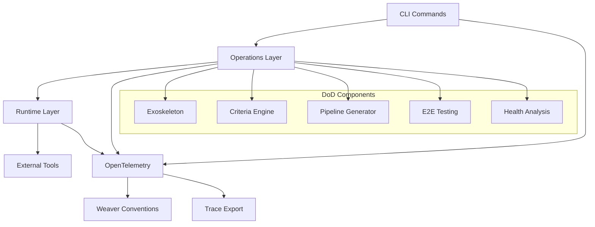

# Definition of Done (DoD) Automation System

A comprehensive, enterprise-grade automation platform that implements the 80/20 principle for complete project lifecycle management, ensuring consistent quality, security, and operational excellence.

## 🎯 Overview

The DoD Automation System provides:
- **Complete Project Automation**: End-to-end validation and automation workflows
- **Weaver Forge Exoskeleton**: Structural automation framework for consistent project setup
- **80/20 Principle**: Focus on high-impact criteria (Testing 25%, Security 25%, DevOps 20%)
- **OpenTelemetry Integration**: Enterprise observability with Weaver semantic conventions
- **AI-Powered Insights**: Intelligent recommendations and autonomous optimization

## 🚀 Quick Start

### Installation
```bash
# Install uvmgr with DoD support
pip install uvmgr

# Verify installation
uvmgr dod --help
```

### Basic Usage
```bash
# Check project status
uvmgr dod status

# Run complete automation
uvmgr dod complete --env production

# Initialize project exoskeleton
uvmgr dod exoskeleton --template enterprise

# Validate specific criteria
uvmgr dod validate --criteria testing,security --detailed
```

## 📊 Core Features

### DoD Criteria (80/20 Implementation)
| Criteria | Weight | Priority | Focus Area |
|----------|--------|----------|------------|
| Testing | 25% | Critical | Unit, Integration, E2E coverage |
| Security | 25% | Critical | Vulnerability scanning, compliance |
| DevOps | 20% | Critical | CI/CD pipelines, deployment automation |
| Code Quality | 10% | Important | Linting, complexity, maintainability |
| Documentation | 10% | Important | API docs, user guides, architecture |
| Performance | 5% | Optional | Benchmarks, optimization |
| Compliance | 5% | Optional | Regulatory, governance |

### Exoskeleton Templates
- **Standard**: Basic automation for typical projects
- **Enterprise**: Advanced governance and compliance features
- **AI-Native**: Cutting-edge AI integration and autonomous capabilities

## 📖 Documentation Structure

### User Documentation
- [Getting Started Guide](./getting-started.md)
- [Command Reference](./commands.md)
- [Configuration Guide](./configuration.md)
- [Templates & Customization](./templates.md)
- [Troubleshooting](./troubleshooting.md)

### Developer Documentation
- [Architecture Overview](./architecture.md)
- [API Reference](./api.md)
- [Contributing Guidelines](./contributing.md)
- [Testing Guidelines](./testing.md)
- [Extension Development](./extensions.md)

### Integration Documentation
- [OpenTelemetry Integration](./otel-integration.md)
- [Weaver Semantic Conventions](./weaver-conventions.md)
- [CI/CD Pipeline Integration](./cicd-integration.md)
- [Monitoring & Observability](./monitoring.md)

### Operational Documentation
- [Deployment Guide](./deployment.md)
- [Security Considerations](./security.md)
- [Performance Tuning](./performance.md)
- [Operational Runbooks](./runbooks.md)

## 🏗️ Architecture



## 🎯 Key Benefits

### For Development Teams
- ✅ **Consistent Quality**: Automated validation ensures all projects meet standards
- ✅ **Faster Onboarding**: Exoskeleton templates provide instant project structure
- ✅ **Reduced Technical Debt**: Continuous validation prevents quality degradation
- ✅ **Enhanced Security**: Automated security scanning and compliance checking

### for Operations Teams
- ✅ **Complete Observability**: OpenTelemetry integration with Weaver conventions
- ✅ **Automated Pipelines**: Generate CI/CD pipelines for any platform
- ✅ **Health Monitoring**: Real-time project health analysis and alerts
- ✅ **Compliance Automation**: Automated governance and audit trail generation

### For Organizations
- ✅ **Cost Reduction**: 80/20 focus on high-impact criteria maximizes ROI
- ✅ **Risk Mitigation**: Comprehensive security and compliance automation
- ✅ **Scalability**: Template-based approach scales across teams and projects
- ✅ **Innovation Enablement**: AI-powered insights drive continuous improvement

## 🔧 Configuration

### Basic Configuration (`.uvmgr/dod.yaml`)
```yaml
# DoD Configuration
automation:
  enabled: true
  level: "supervised"  # autonomous, supervised, manual
  
criteria:
  testing:
    enabled: true
    coverage_threshold: 80
    types: ["unit", "integration", "e2e"]
  
  security:
    enabled: true
    scan_dependencies: true
    vulnerability_threshold: "medium"
  
  devops:
    enabled: true
    provider: "github"
    environments: ["dev", "staging", "production"]

templates:
  default: "standard"
  custom_templates_dir: ".uvmgr/templates"

ai:
  enabled: true
  insights: true
  auto_optimization: false

telemetry:
  enabled: true
  endpoint: "http://localhost:4317"
  service_name: "uvmgr-dod"
```

## 🏃‍♂️ Examples

### Complete Project Setup
```bash
# 1. Initialize new project with DoD automation
uvmgr dod exoskeleton --template enterprise --force

# 2. Configure for your environment
uvmgr dod pipeline --provider github --environments dev,staging,prod

# 3. Run initial validation
uvmgr dod validate --detailed

# 4. Execute complete automation
uvmgr dod complete --env development --auto-fix

# 5. Monitor status
uvmgr dod status
```

### CI/CD Integration
```yaml
# .github/workflows/dod-automation.yml
name: DoD Automation
on:
  push:
    branches: [main, develop]
  pull_request:
    branches: [main]

jobs:
  dod-validation:
    runs-on: ubuntu-latest
    steps:
      - uses: actions/checkout@v3
      - name: Setup Python
        uses: actions/setup-python@v4
        with:
          python-version: '3.11'
      - name: Install uvmgr
        run: pip install uvmgr
      - name: Run DoD Automation
        run: uvmgr dod complete --env ${{ matrix.environment }}
        env:
          OTEL_EXPORTER_OTLP_ENDPOINT: ${{ secrets.OTEL_ENDPOINT }}
```

## 🤝 Contributing

We welcome contributions! Please see our [Contributing Guidelines](./contributing.md) for details.

### Development Setup
```bash
# Clone repository
git clone https://github.com/your-org/uvmgr.git
cd uvmgr

# Install in development mode
pip install -e ".[dev]"

# Run tests
pytest tests/test_dod_*.py -v

# Run DoD validation on itself
python tests/dod_comprehensive_validation.py
```

## 📞 Support

- **Documentation**: [https://docs.uvmgr.dev/dod](https://docs.uvmgr.dev/dod)
- **Issues**: [GitHub Issues](https://github.com/your-org/uvmgr/issues)
- **Discussions**: [GitHub Discussions](https://github.com/your-org/uvmgr/discussions)

## 📄 License

This project is licensed under the MIT License - see the [LICENSE](../../LICENSE) file for details.

---

**Built with ❤️ by the uvmgr team | Powered by the 80/20 principle and enterprise-grade automation**