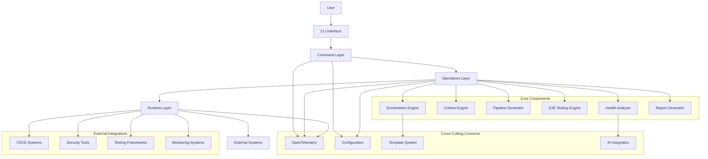
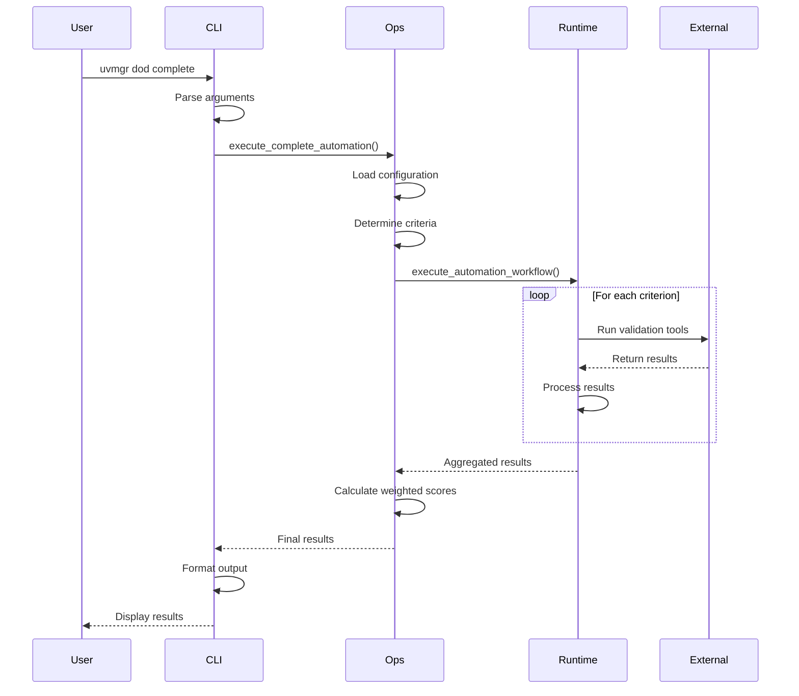
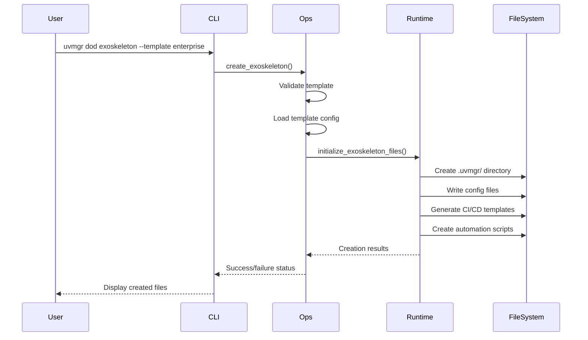
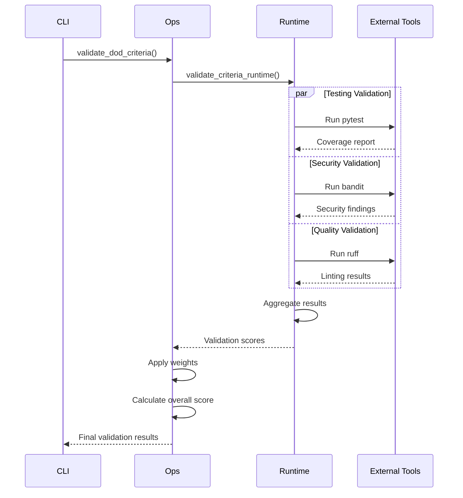

# DoD Architecture Overview

This document provides a comprehensive architectural overview of the Definition of Done (DoD) automation system, including design principles, component interactions, and implementation details.

## Table of Contents
- [Design Principles](#design-principles)
- [System Architecture](#system-architecture)
- [Component Details](#component-details)
- [Data Flow](#data-flow)
- [OpenTelemetry Integration](#opentelemetry-integration)
- [Extension Points](#extension-points)

## Design Principles

### 1. 80/20 Principle (Pareto Principle)
The entire system is designed around focusing on 20% of criteria that deliver 80% of value:

```
Critical Criteria (70% weight):
├── Testing (25%) - Unit, Integration, E2E
├── Security (25%) - Vulnerability scanning, compliance
└── DevOps (20%) - CI/CD, deployment automation

Important Criteria (20% weight):
├── Code Quality (10%) - Linting, complexity
└── Documentation (10%) - API docs, guides

Optional Criteria (10% weight):
├── Performance (5%) - Benchmarks
└── Compliance (5%) - Governance
```

### 2. Layered Architecture
```
┌─────────────────────────────────────┐
│           CLI Commands              │ ← User Interface Layer
├─────────────────────────────────────┤
│         Operations Layer            │ ← Business Logic Layer
├─────────────────────────────────────┤
│          Runtime Layer              │ ← Infrastructure Layer
├─────────────────────────────────────┤
│        External Systems             │ ← Integration Layer
└─────────────────────────────────────┘
```

### 3. Observable by Design
Every operation is instrumented with OpenTelemetry following Weaver semantic conventions:
- Consistent span naming: `dod.*`
- Standardized attributes: `dod.`, `project.`, `automation.*`
- Exception tracking and performance metrics
- Distributed tracing support

### 4. Extensible Template System
Exoskeleton templates provide reusable automation blueprints:
- **Standard**: Basic automation patterns
- **Enterprise**: Governance and compliance
- **AI-Native**: Advanced AI integration

## System Architecture



## Component Details

### CLI Commands Layer (`uvmgr.commands.dod`)

**Purpose**: User interface and command parsing
**Location**: `src/uvmgr/commands/dod.py`

```python
# Command structure
app = typer.Typer(name="dod", help="DoD automation")

@app.command("complete")
def complete_automation(
    environment: str = "development",
    auto_fix: bool = False,
    parallel: bool = True
):
    """Execute complete DoD automation."""
    # Delegate to operations layer
    result = execute_complete_automation(...)
    # Format and display results
```

**Key Features**:
- Rich console output with tables and panels
- Parameter validation and help text
- Error handling and exit codes
- JSON output support for scripting

### Operations Layer (`uvmgr.ops.dod`)

**Purpose**: Business logic and orchestration
**Location**: `src/uvmgr/ops/dod.py`

```python
# Core operations with OTEL instrumentation
@tracer.start_as_current_span("dod.execute_complete_automation")
def execute_complete_automation(
    project_path: Path,
    environment: str = "development",
    criteria: Optional[List[str]] = None,
    auto_fix: bool = False,
    parallel: bool = True,
    ai_assist: bool = True
) -> Dict[str, Any]:
    """Execute complete DoD automation workflow."""
    
    # Set span attributes
    span = trace.get_current_span()
    span.set_attributes({
        "dod.environment": environment,
        "dod.auto_fix": auto_fix,
        "dod.parallel": parallel,
        "project.path": str(project_path)
    })
    
    # Execute workflow
    automation_result = execute_automation_workflow(...)
    
    # Calculate weighted success rate
    success_rate = _calculate_weighted_success_rate(...)
    
    return automation_result
```

**Key Components**:

#### 1. Criteria Engine
```python
DOD_CRITERIA_WEIGHTS = {
    "testing": {"weight": 0.25, "priority": "critical"},
    "security": {"weight": 0.25, "priority": "critical"},
    "devops": {"weight": 0.20, "priority": "critical"},
    "code_quality": {"weight": 0.10, "priority": "important"},
    "documentation": {"weight": 0.10, "priority": "important"},
    "performance": {"weight": 0.05, "priority": "optional"},
    "compliance": {"weight": 0.05, "priority": "optional"}
}
```

#### 2. Weighted Scoring Algorithm
```python
def _calculate_weighted_success_rate(
    criteria_results: Dict[str, Any], 
    criteria: List[str]
) -> float:
    """Calculate weighted success rate using 80/20 principles."""
    total_weight = 0.0
    weighted_score = 0.0
    
    for criteria_name in criteria:
        weight = DOD_CRITERIA_WEIGHTS.get(criteria_name, {}).get("weight", 0.05)
        score = criteria_results[criteria_name].get("score", 0.0)
        
        weighted_score += score * weight
        total_weight += weight
    
    return weighted_score / total_weight if total_weight > 0 else 0.0
```

#### 3. Exoskeleton Templates
```python
EXOSKELETON_TEMPLATES = {
    "standard": {
        "description": "Standard DoD automation for typical projects",
        "includes": ["basic_ci", "testing", "security_scan", "docs"],
        "ai_features": ["code_review", "test_generation"]
    },
    "enterprise": {
        "description": "Enterprise-grade automation with governance", 
        "includes": ["advanced_ci", "multi_env", "security_hardened", "compliance"],
        "ai_features": ["architecture_analysis", "security_advisory"]
    },
    "ai-native": {
        "description": "AI-first automation with cutting-edge capabilities",
        "includes": ["intelligent_ci", "ai_testing", "autonomous_security"],
        "ai_features": ["autonomous_development", "predictive_analysis"]
    }
}
```

### Runtime Layer (`uvmgr.runtime.dod`)

**Purpose**: Infrastructure operations and external tool integration
**Location**: `src/uvmgr/runtime/dod.py`

```python
@span("dod.runtime.execute_automation_workflow")
def execute_automation_workflow(
    project_path: Path,
    criteria: List[str],
    environment: str,
    auto_fix: bool,
    parallel: bool,
    ai_assist: bool
) -> Dict[str, Any]:
    """Execute automation workflow with real infrastructure."""
    
    try:
        start_time = time.time()
        criteria_results = {}
        
        # Execute each criterion validation
        for criterion in criteria:
            if parallel:
                # Execute in parallel using ThreadPoolExecutor
                result = _execute_criterion_parallel(criterion, ...)
            else:
                # Sequential execution
                result = _execute_criterion_sequential(criterion, ...)
            
            criteria_results[criterion] = result
        
        return {
            "success": all(r["passed"] for r in criteria_results.values()),
            "criteria_results": criteria_results,
            "execution_time": time.time() - start_time
        }
        
    except Exception as e:
        return {"success": False, "error": str(e)}
```

**Key Runtime Functions**:

1. **File I/O Operations**: Exoskeleton creation, config management
2. **Process Execution**: Running external tools (pytest, security scanners)
3. **Template Processing**: YAML/JSON generation for CI/CD pipelines
4. **Integration Calls**: API calls to external services

### Configuration System

**Location**: `.uvmgr/dod.yaml`

```yaml
# Hierarchical configuration with environment overrides
automation:
  enabled: true
  level: "supervised"  # autonomous, supervised, manual
  
criteria:
  testing:
    enabled: true
    coverage_threshold: 80
    tools:
      unit: "pytest"
      integration: "pytest"
      e2e: "playwright"
      
environments:
  development:
    criteria:
      testing:
        coverage_threshold: 70  # Lower threshold for dev
  production:
    criteria:
      testing:
        coverage_threshold: 90  # Higher threshold for prod
      security:
        vulnerability_threshold: "low"  # Stricter security
```

## Data Flow

### 1. Command Execution Flow


### 2. Exoskeleton Creation Flow


### 3. Validation Flow


## OpenTelemetry Integration

### Span Hierarchy
```
dod.execute_complete_automation
├── dod.runtime.execute_automation_workflow
│   ├── dod.runtime.validate_criteria_runtime
│   ├── dod.runtime.run_e2e_tests
│   └── dod.runtime.analyze_project_health
├── dod.generate_dod_report
└── dod.runtime.create_automation_report
```

### Span Attributes Schema
```python
# Weaver semantic conventions for DoD operations
SPAN_ATTRIBUTES = {
    # Operation attributes
    "dod.operation": str,          # Operation type
    "dod.template": str,           # Template name
    "dod.environment": str,        # Target environment
    "dod.criteria_count": int,     # Number of criteria
    
    # Configuration attributes  
    "dod.auto_fix": bool,          # Auto-fix enabled
    "dod.parallel": bool,          # Parallel execution
    "dod.ai_assist": bool,         # AI assistance enabled
    
    # Result attributes
    "dod.success_rate": float,     # Overall success rate
    "dod.execution_time": float,   # Execution duration
    "dod.criteria_passed": int,    # Number of passed criteria
    
    # Project attributes
    "project.path": str,           # Project directory
    "project.name": str,           # Project name
    
    # Automation attributes
    "automation.strategy": str,    # 80/20, comprehensive, etc.
    "automation.version": str      # DoD system version
}
```

### Trace Context Propagation
```python
# Context propagation across async operations
async def execute_parallel_criteria(criteria: List[str]) -> Dict[str, Any]:
    """Execute criteria validation in parallel with trace context."""
    
    current_span = trace.get_current_span()
    trace_context = current_span.get_span_context()
    
    tasks = []
    for criterion in criteria:
        # Create child span for each criterion
        with tracer.start_as_current_span(
            f"dod.criterion.{criterion}",
            context=trace.set_span_in_context(current_span)
        ) as child_span:
            child_span.set_attributes({
                "dod.criterion": criterion,
                "dod.criterion.weight": DOD_CRITERIA_WEIGHTS[criterion]["weight"]
            })
            
            task = asyncio.create_task(
                validate_single_criterion(criterion),
                context=trace.set_span_in_context(child_span)
            )
            tasks.append(task)
    
    results = await asyncio.gather(*tasks)
    return dict(zip(criteria, results))
```

## Extension Points

### 1. Custom Criteria
```python
# Register custom criteria
from uvmgr.ops.dod import register_criterion

@register_criterion("accessibility", weight=0.05, priority="optional")
def validate_accessibility(project_path: Path) -> Dict[str, Any]:
    """Custom accessibility validation."""
    # Run accessibility tools (axe-core, lighthouse, etc.)
    return {
        "score": 85.0,
        "passed": True,
        "details": "WCAG 2.1 AA compliance validated"
    }
```

### 2. Custom Templates
```python
# Custom exoskeleton template
CUSTOM_TEMPLATE = {
    "description": "Microservice template with service mesh",
    "includes": [
        "kubernetes_deployment",
        "istio_service_mesh", 
        "distributed_tracing",
        "chaos_engineering"
    ],
    "ai_features": [
        "traffic_analysis",
        "fault_injection",
        "capacity_planning"
    ],
    "structure": {
        "deployment": [
            "k8s/deployment.yaml",
            "k8s/service.yaml",
            "istio/virtual-service.yaml"
        ],
        "monitoring": [
            "monitoring/service-monitor.yaml",
            "monitoring/dashboards/"
        ]
    }
}
```

### 3. Custom AI Integrations
```python
# AI-powered analysis extension
from uvmgr.ai import register_ai_analyzer

@register_ai_analyzer("code_complexity")
async def analyze_code_complexity(project_path: Path) -> Dict[str, Any]:
    """AI-powered code complexity analysis."""
    
    # Use LLM to analyze code patterns
    analysis = await llm_client.analyze_codebase(
        path=project_path,
        focus="complexity_hotspots"
    )
    
    return {
        "complexity_score": analysis.score,
        "hotspots": analysis.hotspots,
        "recommendations": analysis.recommendations
    }
```

### 4. Custom Pipeline Generators
```python
# Custom CI/CD pipeline generator
from uvmgr.runtime.dod import register_pipeline_generator

@register_pipeline_generator("jenkins")
def generate_jenkins_pipeline(
    project_path: Path,
    environments: List[str],
    features: List[str]
) -> Dict[str, Any]:
    """Generate Jenkins pipeline with DoD integration."""
    
    pipeline_script = f"""
    pipeline {{
        agent any
        stages {{
            stage('DoD Validation') {{
                steps {{
                    sh 'uvmgr dod complete --env ${{BRANCH_NAME}}'
                }}
            }}
        }}
        post {{
            always {{
                publishHTML([
                    allowMissing: false,
                    alwaysLinkToLastBuild: true,
                    keepAll: true,
                    reportDir: 'reports',
                    reportFiles: 'dod-report.html'
                ])
            }}
        }}
    }}
    """
    
    return {
        "success": True,
        "files_created": ["Jenkinsfile"],
        "pipeline_script": pipeline_script
    }
```

## Performance Considerations

### 1. Parallel Execution
- Criteria validation runs in parallel by default
- Configurable concurrency limits
- Thread-safe operations with proper locking

### 2. Caching Strategy
```python
# Results caching for expensive operations
from functools import lru_cache
import hashlib

@lru_cache(maxsize=128)
def cached_security_scan(project_hash: str) -> Dict[str, Any]:
    """Cache security scan results by project content hash."""
    # Expensive security scanning operation
    pass

def get_project_hash(project_path: Path) -> str:
    """Generate hash of project content for caching."""
    hasher = hashlib.sha256()
    for file_path in project_path.rglob("*.py"):
        hasher.update(file_path.read_bytes())
    return hasher.hexdigest()
```

### 3. Resource Management
- Configurable timeouts for external tool execution
- Memory-efficient streaming for large outputs
- Graceful degradation on resource constraints

## Security Architecture

### 1. Secure by Default
- No hardcoded credentials or secrets
- Environment variable injection for sensitive data
- Secure temporary file handling

### 2. Sandboxed Execution
```python
# Sandboxed execution of external tools
import subprocess
import tempfile
from pathlib import Path

def execute_sandboxed_tool(
    command: List[str], 
    project_path: Path,
    timeout: int = 300
) -> subprocess.CompletedProcess:
    """Execute external tool in sandboxed environment."""
    
    with tempfile.TemporaryDirectory() as temp_dir:
        # Copy only necessary files to temp directory
        safe_project_path = Path(temp_dir) / "project"
        copy_safe_files(project_path, safe_project_path)
        
        # Execute with restricted permissions
        result = subprocess.run(
            command,
            cwd=safe_project_path,
            capture_output=True,
            text=True,
            timeout=timeout,
            env=get_sanitized_env()
        )
        
        return result
```

### 3. Audit Trail
- All operations logged with OpenTelemetry
- Configuration changes tracked
- Security-relevant events highlighted

This architecture provides a solid foundation for the DoD automation system while maintaining flexibility for future enhancements and integrations.