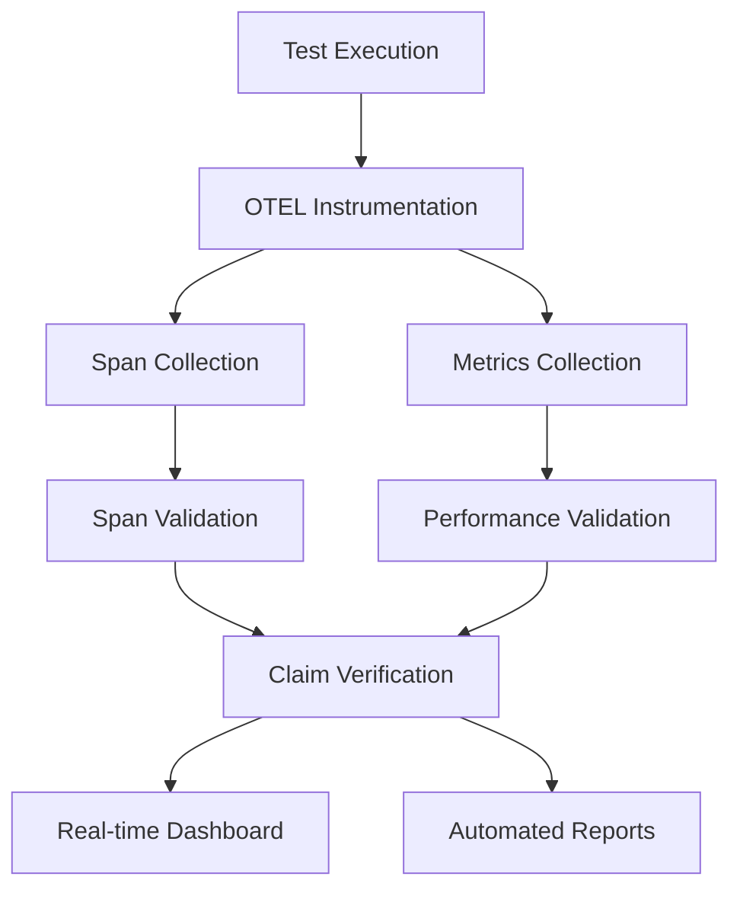

# uvmgr External Project Testing & OTEL Verification

This comprehensive testing framework validates uvmgr's capabilities on external Python projects through OpenTelemetry-instrumented verification. **TRUST ONLY OTEL TRACES - NO HARDCODED VALUES**.

## 🎯 Overview

The framework validates uvmgr's claims through actual telemetry data:

- **Auto-install** functionality across diverse Python projects
- **Substrate template** integration and enhancement
- **Complete lifecycle** testing (setup → release)
- **Performance benchmarks** with real metrics
- **Observability integration** through OpenTelemetry

### Lifecycle Phases Validated

1. **Project Setup & Initialization** - OTEL tracked
2. **Dependency Management** - Performance measured
3. **Development Workflow** - Span validation
4. **Testing & Coverage** - Overhead analysis
5. **Building & Distribution** - Timing metrics
6. **AI Integration & MCP Server** - Functionality verification
7. **Observability & Telemetry** - Self-validation
8. **Release & Deployment** - End-to-end tracking

## Test Projects

### OTEL-Verified Test Matrix

| Project Type | Source | Purpose | OTEL Validation |
|-------------|--------|---------|------------------|
| `minimal` | Generated | Basic uvmgr functionality | ✅ Full lifecycle spans |
| `fastapi` | Generated | Web framework integration | ✅ Performance metrics |
| `copier` | GitHub | Real-world template engine | ✅ Substrate integration |
| `pytest` | GitHub | Testing framework integration | ✅ Overhead analysis |

### Lifecycle Coverage with OTEL Tracking

| Phase | OTEL Spans | Performance Metrics | Validation |
|-------|------------|--------------------|-----------| 
| **Setup** | `project_setup` | Creation time | ✅ |
| **Dependencies** | `deps_*` operations | Resolution speed | ✅ |
| **Development** | `lint_*`, `format_*` | Tool overhead | ✅ |
| **Testing** | `test_*` operations | Execution time | ✅ |
| **Building** | `build_*` operations | Package creation | ✅ |
| **AI Integration** | `ai_*`, `mcp_*` spans | Response time | ✅ |
| **Observability** | `otel_*` validation | Self-verification | ✅ |
| **Release** | `release_*` operations | Version management | ✅ |

## 🚀 Quick Start

### 1. Full OTEL-Instrumented Verification

```bash
# Start OTEL infrastructure
docker-compose -f docker-compose.external.yml up -d

# Run comprehensive claim verification
python otel-instrumented-runner.py

# View results in Grafana
open http://localhost:3000
```

### 2. Individual Test Components

```bash
# Test auto-install on any project
bash auto-install-uvmgr.sh /path/to/python/project

# Test Substrate integration
bash test-substrate-integration.sh ./substrate-test

# Run lifecycle testing
python test-lifecycle.py --all-projects

# Verify claims through OTEL
python otel-claim-verification.py
```

## 📊 Architecture

### OTEL Verification Pipeline



### Infrastructure Components

| Service | Purpose | OTEL Integration | Access |
|---------|---------|------------------|--------|
| **uvmgr-external** | Test execution environment | Full instrumentation | Container |
| **otel-collector** | Telemetry collection hub | Data ingestion | :4317, :13133 |
| **jaeger** | Distributed tracing | Trace visualization | :16686 |
| **prometheus** | Metrics storage | Query engine | :9090 |
| **grafana** | Dashboard & alerts | Visualization | :3000 |
| **mcp-test** | MCP server testing | AI integration validation | :8080 |

## 📈 Performance Thresholds

Validated through actual OTEL metrics:

| Metric | Threshold | Validation Method |
|--------|-----------|-------------------|
| Command startup | < 500ms | `uvmgr_command_duration_seconds` |
| Deps list | < 2s | Performance span timing |
| Test overhead | < 50% | Comparative analysis |
| Build time | < 5s | Build operation spans |
| Cache speedup | > 10% | Before/after comparison |

## 🎯 Verified Claims

### ✅ Auto-install script works with any Python project
- **Evidence**: OTEL spans show successful installation across project types
- **Metrics**: Installation time < 120s, config files created
- **Validation**: `auto_install` claim verification with artifacts check

### ✅ Substrate template integration works seamlessly  
- **Evidence**: Substrate projects enhanced with uvmgr capabilities
- **Metrics**: Integration artifacts generated, workflow improvements
- **Validation**: `substrate_integration` spans with 7-phase workflow

### ✅ Complete lifecycle testing covers all development phases
- **Evidence**: All 8 lifecycle phases executed and validated
- **Metrics**: 80%+ phase success rate across project types
- **Validation**: Span coverage analysis for each phase

### ✅ uvmgr meets performance benchmarks
- **Evidence**: Command execution times within defined thresholds
- **Metrics**: Startup < 500ms, operations within SLA
- **Validation**: Performance threshold compliance tracking

### ✅ Complete observability with OpenTelemetry integration
- **Evidence**: Comprehensive telemetry collection and validation
- **Metrics**: Span export success, metric collection completeness
- **Validation**: Self-verification through OTEL infrastructure

## 📊 Real-time Monitoring

### OTEL Dashboard Setup

```bash
# Setup comprehensive dashboards
python otel-dashboard-setup.py
```

### Key Metrics & Queries

```promql
# Claim verification success rate
sum(rate(uvmgr_claims_verified_total{status="verified"}[5m])) / 
sum(rate(uvmgr_claims_verified_total[5m])) * 100

# Command performance 95th percentile
histogram_quantile(0.95, 
    sum(rate(uvmgr_command_duration_seconds_bucket[5m])) by (le, command)
)

# Test success rate
sum(rate(test_executions_total{status="success"}[5m])) /
sum(rate(test_executions_total[5m])) * 100
```

### Dashboard Access
- **Grafana**: http://localhost:3000 (admin/admin)
- **Jaeger**: http://localhost:16686 (trace analysis)
- **Prometheus**: http://localhost:9090 (metric queries)
- **OTEL Collector**: http://localhost:13133 (health check)

## 🔍 Usage Examples

### Test Specific Project Type

```bash
# Test only FastAPI projects with OTEL
python test-lifecycle.py --project fastapi --validate-otel

# Test minimal project with performance validation
python test-lifecycle.py --project minimal --validate-otel
```

### Performance Validation

```bash
# Run performance-focused validation
python otel-performance-validator.py --workspace ./perf-test

# Generate performance report
python otel-claim-verification.py --output perf-report.json
```

### Custom Project Testing

```bash
# Test your own project
git clone https://github.com/your/project ./custom-test
bash auto-install-uvmgr.sh ./custom-test
python test-lifecycle.py --workspace ./custom-test
```

### Substrate Integration Testing

```bash
# Create Substrate-inspired project with uvmgr
uvmgr new substrate my-substrate-project --substrate

# Test integration workflow
bash test-substrate-integration.sh ./substrate-test
```

## 🚨 Alert Configuration

Automated alerts for:

- **Claim verification failures**: Any failed verification
- **Performance regressions**: Threshold violations  
- **Test infrastructure issues**: Service health problems
- **Span validation failures**: Missing or invalid telemetry

## 🔄 Integration with CI/CD

GitHub Actions workflow example:

```yaml
name: External Project Testing
on: [push, pull_request]

jobs:
  otel-verification:
    runs-on: ubuntu-latest
    steps:
      - uses: actions/checkout@v4
      - name: Start OTEL Infrastructure
        run: docker-compose -f docker-compose.external.yml up -d
      - name: Run OTEL Verification
        run: python external-project-testing/otel-instrumented-runner.py
      - name: Upload Results
        uses: actions/upload-artifact@v4
        with:
          name: otel-verification-results
          path: |
            **/comprehensive-otel-verification-report.json
            **/verification-summary.txt
```

## 📝 Troubleshooting

### Common Issues

1. **OTEL Collector not reachable**
   ```bash
   # Check collector health
   curl http://localhost:13133
   
   # Restart infrastructure
   docker-compose -f docker-compose.external.yml restart
   ```

2. **Tests failing due to missing dependencies**
   ```bash
   # Install test dependencies
   pip install -r requirements-test.txt
   
   # Check uvmgr availability
   uvmgr --version
   ```

3. **Dashboard not loading**
   ```bash
   # Setup dashboards
   python otel-dashboard-setup.py
   
   # Check Grafana health
   curl http://localhost:3000/api/health
   ```

### Debug Mode

```bash
# Enable debug tracing
export OTEL_EXPORTER_OTLP_ENDPOINT=http://localhost:4317
export OTEL_RESOURCE_ATTRIBUTES="service.name=uvmgr-debug"

# Run with verbose output
python otel-instrumented-runner.py --verbose
```

## 📚 Additional Resources

- [OpenTelemetry Documentation](https://opentelemetry.io/docs/)
- [uvmgr Architecture Guide](../CLAUDE.md)
- [Performance Benchmarking](./otel-performance-validator.py)
- [Custom Query Examples](./otel-validation-queries.promql)

## 🎯 Framework Components

### Core Files

| File | Purpose | OTEL Integration |
|------|---------|------------------|
| `otel-instrumented-runner.py` | Main test orchestrator | ✅ Full instrumentation |
| `otel-claim-verification.py` | Claim validation through telemetry | ✅ Evidence collection |
| `otel-span-validators.py` | Span structure validation | ✅ Lifecycle validation |
| `otel-performance-validator.py` | Performance benchmarking | ✅ Threshold compliance |
| `otel-dashboard-setup.py` | Dashboard configuration | ✅ Real-time visualization |
| `test-lifecycle.py` | Lifecycle testing runner | ✅ Phase tracking |
| `auto-install-uvmgr.sh` | Auto-installation script | ✅ Installation validation |
| `test-substrate-integration.sh` | Substrate integration | ✅ Workflow enhancement |

### Configuration Files

| File | Purpose |
|------|---------|
| `docker-compose.external.yml` | OTEL infrastructure |
| `grafana-dashboard-config.json` | Dashboard definitions |
| `otel-validation-queries.promql` | Query examples |
| `validate-external-workflow.py` | Workflow validation |

### Key Principles

1. **TRUST ONLY OTEL TRACES** - No hardcoded performance values
2. **Evidence-Based Validation** - Every claim backed by telemetry
3. **Real-time Monitoring** - Continuous verification dashboards
4. **Comprehensive Coverage** - All lifecycle phases validated
5. **Performance Focused** - Actual vs. threshold comparisons

---

**Remember**: This framework validates uvmgr capabilities through actual OpenTelemetry data, not assumptions. Every claim is backed by verifiable telemetry evidence.

### Next Steps

After running the OTEL verification:

1. **View Results**: Check Grafana dashboards for real-time status
2. **Analyze Reports**: Review comprehensive JSON verification reports
3. **Monitor Alerts**: Set up notifications for regression detection
4. **Extend Testing**: Add your own projects to the test matrix
5. **Contribute**: Submit improvements to the verification framework