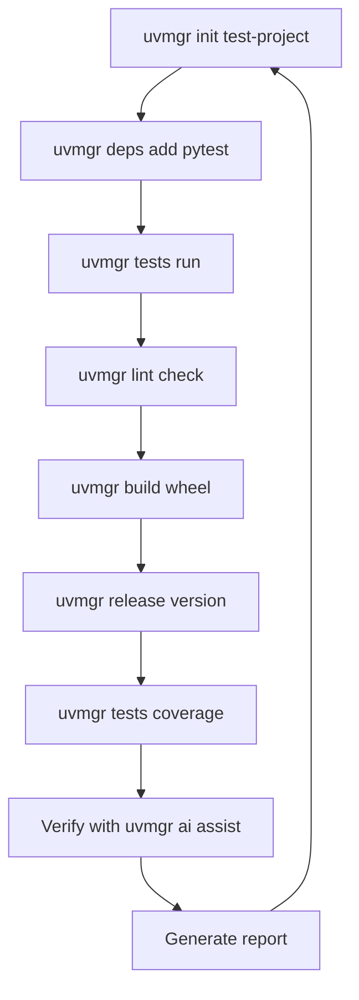

# uvmgr Dogfooding E2E Test Loop

## Overview

A self-referential test loop where uvmgr tests itself using its own commands, creating a true dogfooding experience.

## Architecture

### 1. Test Infrastructure

```
tests/
  e2e/
    conftest.py          # Shared fixtures and helpers
    fixtures/
      sample_project/    # Test project templates
      expected_outputs/  # Expected command outputs
    test_workflows.py    # Core workflow tests
    test_dogfooding.py   # Self-testing scenarios
    test_performance.py  # Performance benchmarks
```

### 2. Dogfooding Test Loop



### 3. Core Test Scenarios

#### Scenario 1: Full Development Cycle
```python
def test_full_dev_cycle_dogfooding(temp_project):
    """Test complete development workflow using uvmgr itself."""
    # 1. Initialize project
    run_uvmgr("init", temp_project)
    
    # 2. Add dependencies
    run_uvmgr("deps", "add", "pytest", "--dev")
    run_uvmgr("deps", "add", "rich")
    
    # 3. Create sample code
    create_sample_module(temp_project)
    
    # 4. Run tests
    run_uvmgr("tests", "run")
    
    # 5. Check lint
    run_uvmgr("lint", "check")
    
    # 6. Build
    run_uvmgr("build", "wheel")
    
    # 7. Verify outputs
    assert_project_structure(temp_project)
    assert_venv_exists(temp_project)
    assert_build_artifacts(temp_project)
```

#### Scenario 2: Self-Testing Loop
```python
def test_uvmgr_tests_itself():
    """uvmgr runs its own test suite."""
    # Use uvmgr to run uvmgr's tests
    result = run_uvmgr("tests", "run", "--project", ".")
    assert result.returncode == 0
    
    # Generate coverage
    result = run_uvmgr("tests", "coverage")
    assert_coverage_report_exists()
```

#### Scenario 3: Error Recovery
```python
def test_error_handling_cascade():
    """Test error handling across commands."""
    # Intentionally fail
    result = run_uvmgr("deps", "add", "nonexistent-package-12345")
    assert result.returncode != 0
    
    # Verify graceful recovery
    result = run_uvmgr("deps", "list")
    assert result.returncode == 0
```

### 4. Performance Benchmarks

```python
@pytest.mark.benchmark
def test_command_performance():
    """Benchmark key commands."""
    benchmarks = {}
    
    # Time critical operations
    with timer() as t:
        run_uvmgr("deps", "list")
    benchmarks["deps_list"] = t.elapsed
    
    with timer() as t:
        run_uvmgr("tests", "run", "--file", "test_simple.py")
    benchmarks["single_test"] = t.elapsed
    
    # Compare with direct uv
    assert benchmarks["deps_list"] < 1.0  # Under 1 second
    report_benchmarks(benchmarks)
```

### 5. MCP Server Testing

```python
async def test_mcp_server_dogfooding():
    """Test MCP server using uvmgr commands."""
    # Start server
    server = await start_uvmgr_serve()
    
    # Use AI commands through MCP
    result = await run_uvmgr("ai", "assist", "List dependencies")
    assert "dependencies" in result.output
    
    # Test tool execution
    result = await mcp_execute_tool("deps_list")
    assert result.success
```

### 6. Telemetry Validation

```python
def test_telemetry_dogfooding():
    """Verify telemetry using uvmgr's own tools."""
    with telemetry_capture() as traces:
        run_uvmgr("deps", "add", "pytest")
        
    # Verify traces
    assert_trace_exists("uvmgr.deps.add")
    assert_span_attributes(traces, {
        "package.name": "pytest",
        "command.type": "deps"
    })
```

## Implementation Steps

### Phase 1: Infrastructure
1. Create e2e test directory structure
2. Implement test helpers and fixtures
3. Create sample project templates

### Phase 2: Core Tests
1. Implement workflow tests
2. Add error handling tests
3. Create performance benchmarks

### Phase 3: Dogfooding Loop
1. Self-testing scenarios
2. Recursive test execution
3. Coverage validation

### Phase 4: Advanced
1. MCP server tests
2. AI integration tests
3. Telemetry validation

## Test Execution

```bash
# Run all e2e tests using uvmgr itself
uvmgr tests run tests/e2e/ --verbose

# Run specific scenario
uvmgr tests run tests/e2e/test_dogfooding.py::test_uvmgr_tests_itself

# Generate coverage report
uvmgr tests coverage --include-e2e

# Run with telemetry
OTEL_EXPORTER_OTLP_ENDPOINT=http://localhost:4317 uvmgr tests run tests/e2e/
```

## CI/CD Integration

```yaml
name: Dogfooding E2E Tests

on: [push, pull_request]

jobs:
  dogfood-test:
    runs-on: ubuntu-latest
    steps:
      - uses: actions/checkout@v3
      
      - name: Install uvmgr
        run: pip install -e .
        
      - name: Run dogfooding loop
        run: |
          uvmgr init test-project
          uvmgr tests run tests/e2e/test_dogfooding.py
          
      - name: Self-test
        run: uvmgr tests run --project . --verbose
        
      - name: Coverage report
        run: uvmgr tests coverage --fail-under 80
```

## Success Metrics

1. **Functional**: All commands work when called by uvmgr itself
2. **Performance**: No significant overhead vs direct uv calls
3. **Reliability**: 100% pass rate in CI/CD
4. **Coverage**: >80% code coverage through e2e tests
5. **Telemetry**: All commands produce valid OTEL traces

## Anti-Patterns to Avoid

1. Don't mock in e2e tests - use real commands
2. Don't skip cleanup - each test should be isolated
3. Don't ignore performance - track regression
4. Don't test implementation - test behavior
5. Don't forget edge cases - test failures too